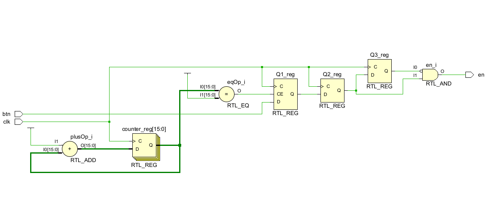
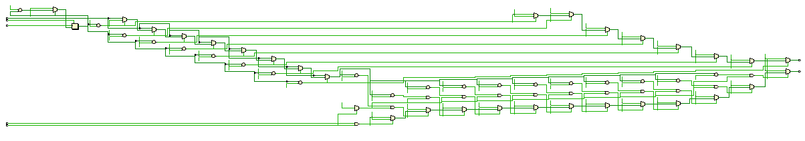
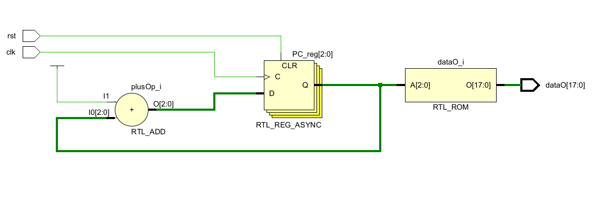
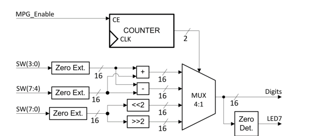
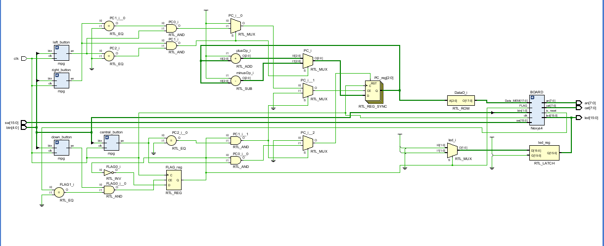

### **📌 FPGA - Calculator**

## **🚀 Overview**
This project seeks to implement a fully functional FPGA based calculator with memory capabilities, as well as user input operands. The goal is to experiment with the Nexys4
development board an vivado enviroment and to create a complex ALU for signed 8 bit numbers, that has 2 functioning modes:

1. **User input**
   - Retrieves the operands from the FPGA's switches
   - Displays output on the SSD's of the board

2. **Memory mode**
   - Fetches predefined operands and operations from a ROM memory.
   - Uses the specific **operation opcodes** in order to execture the operation and display the results.

### **Project Structure**
The main module, `Command_Unit`, integrates various submodules, as shown below:

- **The various buttons for selecting operations, the operating mode**
- The Board module, which itself holds the **ALU**, **Data Formatter**, **SSD LOGIC**, as well as other buttons

## **General Hardware overview**

### Debouncing
Each of the buttons used in this project are debounced. This is achieved by using a common D-FLIP-FLOP debouning design.

---

### The multiplexing for the SSD
The multiplexing is done in order to select the corresponding anodes and cathods for display. We do this by taking the upper bits of the counter, and using them to switch fast trough the anodes and their corresponding data encodings.

---

### The ROM memory
The rom memory is essentially an array of vectors that store the operation done on 2 operands, as well as the operands themselves. It consists of 18 bits of data for each of the encoding. We use a flag bit to indicate wether we want to go up/down in the memory, 
depending on a program counter that we increment or decrement.

---

### Frequency dividing
We use this concept for most counters in order to time events accordingly. This is noticable especially when the FPGA enters a reset state, and one of the leds blinks once evey half a second, with a period of 1 second.

---

### ALU
The ALU is heavily inspired on the standard multiplexing design, though it uses some operations differently, leveraging the powerful features of the VHDL language.
A rough design:

---

## **🖥 RTL Design Screenshot**
Below is the generated **RTL schematic** from Vivado for the project.

---

### **📌 How to Run**
1. Open **Vivado** and load the project.
2. Run and synthesize `Command_Unit`.

---

